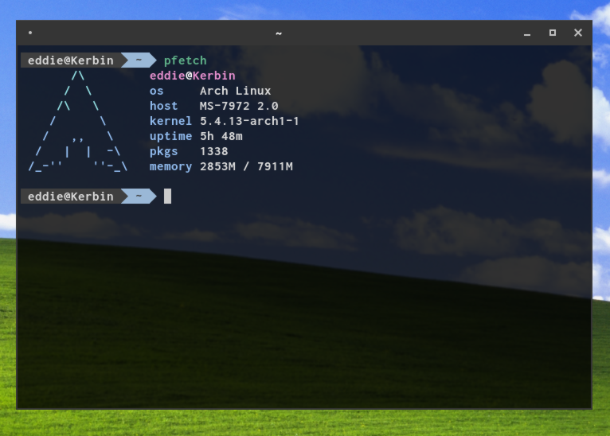

# Suckless Terminal

My little fork of [st](https://st.suckless.org/) with a few patches that improve it for me.

## Patches Applied

  * [alpha](https://st.suckless.org/patches/alpha/) - Opacity of 0.75
  * [anysize](https://st.suckless.org/patches/anysize/)
  * [scrollback](https://st.suckless.org/patches/scrollback/) - Shift + PgUp/PgDn to scroll through terminal history
  * [one clipboard](https://st.suckless.org/patches/clipboard/)

### Other Niceties

  * Dark Pastel Colour Scheme (Originally a default in xfce terminal)

## Installation
`git clone https://github.com/Eddie-Jeselnik/st`

`cd st`

`sudo make install`
